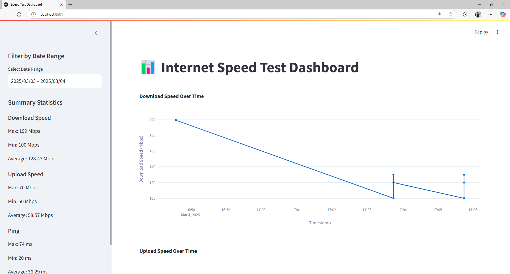

# TamerOnline Speed Net

## Overview
TamerOnline Speed Net is a Python-based internet speed test tool that automates speed measurements and stores the results in an SQLite database. The project supports cross-platform virtual environment setup and integrates seamlessly with VS Code.

## 🖼 Screenshots



## Features
- **Cross-platform compatibility**: Works on Windows, Linux, and macOS.
- **Automated virtual environment setup**: Easily create and activate a Python virtual environment.
- **Internet speed test**: Measures download speed, upload speed, and ping.
- **Results storage**: Saves test results in an SQLite database.
- **Command-line execution**: Run tests with a simple command.
- **Unit Testing**: Includes test cases to validate database functionality.

## Prerequisites
- **Python 3.6+** installed.
- **Git (optional)** for cloning the repository.
- **VS Code (optional)** for an optimized development experience.

## Installation and Setup

### Clone the Repository
Ensure Git is installed and clone the project:
```bash
git clone https://github.com/TamerOnLine/speed_net.git
cd speed_net
```

### Setting Up the Virtual Environment
#### Windows (Command Prompt):
```cmd
activate_project.bat
```
#### Windows (PowerShell):
```powershell
.\activate_project.ps1
```
#### Linux/macOS:
```bash
chmod +x activate_project.sh
./activate_project.sh
```

### Installing Dependencies
After activating the virtual environment:
```bash
pip install -r requirements.txt
```

## Running the Speed Test
To execute the speed test, run:
```bash
python src/main.py
```
This will measure your internet speed and store the results in `speed_results.db`.

## Viewing Previous Test Results
To retrieve the last 5 speed test results:
```bash
python src/main.py
```
The output will display previous test results, including download speed, upload speed, ping, and timestamp.

## File Structure
```
tameronline-speed_net/
├── .github/                 # GitHub workflows
├── img/                     # Image assets
├── src/                     # Source code
│   ├── __init__.py          # Init file for Python package
│   ├── main.py              # Speed test script
│   └── runner.py            # Script runner
├── tests/                   # Unit tests
│   ├── __init__.py
│   └── test_speedtest.py    # Test cases
├── activate_project.bat     # Windows CMD activation script
├── activate_project.ps1     # Windows PowerShell activation script
├── activate_project.sh      # Linux/macOS activation script
├── LICENSE                  # License file
├── README.md                # Documentation
├── requirements.txt         # Python dependencies
├── runtime.txt              # Python runtime version
├── speed_results.db         # SQLite database storing results
└── workspace.code-workspace # VS Code workspace file
```

## Running Tests
To validate database and speed test functionality, run:
```bash
pytest tests/
```

## Troubleshooting
- **Python not found**: Ensure Python 3.6+ is installed and added to the system path.
- **Activation failure**: Delete the `venv` folder and rerun the activation script.
- **Permission issues (Linux/macOS)**: Use `chmod +x activate_project.sh` to grant execution permissions.

## Contribution
Submit pull requests or report issues on the [GitHub repository](https://github.com/TamerOnLine/speed_net).

## License
This project is licensed under the MIT License. See [LICENSE](LICENSE) for details.

